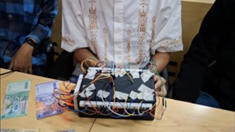
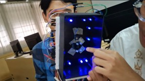

# Deteksi Nominal Uang untuk Tunanetra (Berbasis Raspberry Pi)

Sistem deteksi uang kertas Indonesia menggunakan sensor warna dan AI untuk membantu tunanetra mengenali nominal uang secara mandiri. Sistem ini dirancang untuk berjalan secara mandiri di atas **Raspberry Pi** yang bertindak sebagai unit pemrosesan utama.

## 📸 Tampilan Perangkat Keras

*Hardware Sistem*


*LED UV Hardware*

---

## ✨ Fitur Utama

- **Akurasi Tinggi**: Tingkat keberhasilan deteksi mencapai **97.58%**.
- **Audio Feedback**: Output suara jernih dalam Bahasa Indonesia untuk setiap nominal uang.
- **Sistem Mandiri (Standalone)**: Seluruh proses, dari sensor hingga prediksi AI dan output suara, dijalankan di Raspberry Pi.
- **Autentikasi UV**: Memanfaatkan LED UV untuk mendeteksi fitur keamanan tersembunyi pada uang kertas.

## 🛠️ Teknologi yang Digunakan

#### Perangkat Keras (Hardware)
* **Pusat Pemrosesan**: Raspberry Pi (Model 3B+ atau lebih baru)
* **Pengonversi Sinyal Sensor**: Arduino Nano, digunakan untuk membaca dan mengonversi sinyal frekuensi dari sensor TCS3200 menjadi data RGB.
* **Sensor**: Sensor Warna TCS3200
* **Iluminasi**: LED UV (365nm-400nm)
* **Output**: Speaker atau Headphone

#### Perangkat Lunak (Software)
* **Sistem Operasi**: Raspberry Pi OS
* **Bahasa**: Python
* **Library Utama**:
    * **Scikit-learn**: Untuk model Random Forest & Preprocessing
    * **Pandas**: Manipulasi dan agregasi data
    * **Pygame**: Untuk memainkan file audio MP3
    * **Pyserial**: Komunikasi serial antara Raspberry Pi dan Arduino

---

## 🧠 Arsitektur Model AI (Detail)

Model Machine Learning pada proyek ini dirancang untuk dapat mengenali nominal uang berdasarkan data warna yang diterima dari sensor.

* **Algoritma**: **Random Forest Classifier**. Dipilih karena kemampuannya yang sangat baik dalam menangani data non-linear dan memberikan akurasi yang tinggi tanpa rentan terhadap *overfitting*.
* **Dataset & Feature Engineering**:
    * Model dilatih menggunakan **12.400+ sampel data RGB** yang diambil dari 8 nominal uang kertas Indonesia.
    * **Proses**: Data mentah RGB dinormalisasi, lalu dikonversi ke ruang warna HSV (Hue, Saturation, Value) yang lebih stabil terhadap perubahan pencahayaan. Nilai rata-rata (mean) dan standar deviasi (std) dari H, S, dan V kemudian diekstrak sebagai 6 fitur utama untuk model.
* **Training & Validasi**:
    * Menggunakan **Grid Search** untuk menemukan hyperparameter terbaik dan **5-fold Stratified Cross-Validation** untuk memastikan model dapat melakukan generalisasi dengan baik.
* **Performa**: Akurasi final yang dicapai adalah **97.58%** (± 2.67%), menunjukkan performa yang sangat stabil.

---

## 🚀 Memulai (Getting Started)

Berikut adalah instruksi untuk menyiapkan sistem ini di Raspberry Pi Anda.

### 1. Prasyarat
- Sebuah Raspberry Pi dengan Raspberry Pi OS terinstal.
- Python 3.x.
- Semua komponen hardware terhubung dengan benar.

### 2. Instalasi
1.  **Clone Repository ke Raspberry Pi**
    ```sh
    git clone [https://github.com/Azvi27/sistem-soft-sensor-prediksi-gempa.git](https://github.com/Azvi27/sistem-soft-sensor-prediksi-gempa.git)
    cd sistem-soft-sensor-prediksi-gempa
    ```

2.  **Unduh Model & Data**
    File `.pkl` (model) dan `.csv` (data) tidak disertakan di repository ini.
    - **Unduh dari:** [**Kelompok Teknologi sensor - Google Drive**](PASTE_LINK_GOOGLE_DRIVE_ANDA_DI_SINI)
    - **Petunjuk:** Letakkan semua file yang diunduh ke dalam folder `Kelompok Teknologi sensor/`.

3.  **Install Dependensi Python**
    ```sh
    pip install -r requirements.txt
    ```
    *(Pastikan file `requirements.txt` ada di folder `Kelompok Teknologi sensor`)*.

### 3. Menjalankan Sistem
1.  Pastikan semua hardware (sensor ke Arduino, Arduino ke Pi, speaker ke Pi) terhubung.
2.  Jalankan skrip prediksi utama dari dalam folder `Kelompok Teknologi sensor`:
    ```sh
    python realtime_prediction_MeanStd_RF.py
    ```
3.  Sistem kini aktif dan siap mendeteksi uang.
